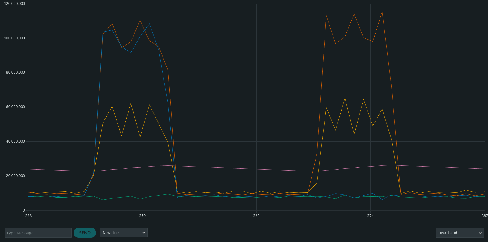

---
title: RP2040 Audio Communication
layout: default
filename: rp2040_audio
order: 2024
--- 

# RP2040 Audio Communication

## Demo
A quick demo of this project is available here:
<iframe src="https://www.youtube.com/embed/Fsx4Ek3jXTU" title="YouTube video player" frameborder="0" allow="accelerometer; autoplay; clipboard-write; encrypted-media; gyroscope; picture-in-picture" allowfullscreen></iframe>

## Technical Details

### Direct Digital Synthesis
To generate the audio, I used [Direct Digital Synthesis](https://vanhunteradams.com/DDS/DDS.html). This stems from a realization that an unsigned integer being periodically incremented by a constant amount and overflowing will result in a periodic signal in the value of that integer, which is therefore roughly analogous to a periodic audio signal. Therefore, I create a size 256 array, and populate with the values of `sin(i/256 * 2π)` in a fixed-point format. For each frequency I want to send out, I have a `uint_32t` phase accumulator which is periodically incremented in the ISR of the ADC in free-running mode. The top 8 bits of the phase accumulator are used to index the sine table, to get the values sent to the DAC. The increment of the phase accumulator is chosen such that the frequency of the accumulator overflowing will match the frequency of the sine wave we want to send out.

### Accumulative Fourier Transform
Typically someone interested in extracting frequency content from data would use an FFT, which will get you the strength of the signal at each frequency in `O(log(n))` time. However, this doesn't match our use-case very well, because we're only interested in the strengths of 8 specific frequencies. Additionally, we'd need to have all the data for the FFT before we can start evaluating it, which may jeopardize the timing requirements of our ADC ISR. Instead, we realize that we already have a sine table and phases giving us a live-view of the sine function for each frequency. We can generate a similar live-view of the cosine functions for each frequency, and use those to incrementally calculate the integral of the sine and cosine waves multiplied by our ADC value, which is the very definition of a Fourier Transform! Therefore, this simple block of code placed in our ADC ISR will give us a live value of the real and imaginary parts of the Fourier Transform of our signals at each frequency.

```C
for (int i = 0; i < NUM_FREQS; i++) {
    uint32_t sin_table_index = output_phases[i] >> (32 - SIN_TABLE_BITS);
    sin_integrals[i] += (int32_t)sin_table[sin_table_index] * (int32_t)adc_val;
    cos_integrals[i] += (int32_t)cos_table[sin_table_index] * (int32_t)adc_val;
}
```

We then just need to periodically collect our data to get the strength of the signal at each frequency using the [Alpha max plus beta min algorithm](https://en.wikipedia.org/wiki/Alpha_max_plus_beta_min_algorithm).

```C
for (int i = 0; i < NUM_FREQS; i++) {
    int64_t sin_abs = labs(sin_integrals[i]);
    int64_t cos_abs = labs(cos_integrals[i]);
    if (sin_abs > cos_abs) {
        strengths[i] = sin_abs + (cos_abs >> 2) + (cos_abs >> 3);
    } else {
        strengths[i] = cos_abs + (sin_abs >> 2) + (sin_abs >> 3);
    }

    sin_integrals[i] = 0;
    cos_integrals[i] = 0;
    dbg_print = 1;
}
```
We now have a way to get periodic measurements of which frequencies are being played or not played at any given moment!

### Data Encoding
Once we have the ability to play and listen for arbitrary frequencies, encoding data is actually relatively trivial. In this case, I chose 8 frequencies, such that none of them are near integer multiples of each other (as to avoid harmonic overlaps). As ASCII is a 7-bit encoding, we choose to play or not play each of 7 frequencies to correspond to a 1 or a 0 in the ASCII encoding of a character. The 8th frequency is always played, and is used for automatic threshold detection and synchronization.

### Automatic Threshold Detection
We now need a way to detect what "counts" as a 1 or a 0 when listening for data. We could simply look at the signal and hard-code a value, but that would be a poor decision, as it wouldn't be able to accommodate different noise-floors, signal strengths, or future architecture changes. Instead, we can have the threshold update based on measured values of the signal strength. As we already have a frequency which will always play whenever the other board is sending data, we can look at the strength of that frequency over time, and effectively put it through a low-pass filter. We can then take the low-passed-filtered value and compare it to the signal to determine whether a high or low has been measured. This is accomplished with the following code block:
```C
int64_t diff = strengths[NUM_FREQS - 1] - THRESHOLD;
if (strengths[NUM_FREQS - 1] > THRESHOLD) {
    THRESHOLD += diff >> 6;
    seen_high = 1;
} else {
    THRESHOLD += diff >> 6;
    seen_high = 0;
}
```
The result of this can be seen on this graph. The continuously updating threshold (shown in pink) is just a low-passed-filtered version of the always-played frequency strength (shown in yellow). This threshold is used to be the threshold of all the other data lines (shown in blue, orange, and green). Note that the yellow strength is weaker than the other frequencies. This is due to the gain of the microphone we're using and the fact that it's the highest frequency, but is convenient for us as it the alternative would be more likely to lead to false negatives.



### Synchronization
As these boards have no electrical communication to each other, they have no shared clock and given time would slowly come out of sync. Therefore, we need to implement an active synchronization protocol to get them in sync with each other and keep them in sync. In this case, I used the always-transmitted frequency to create a phase-locked loop. This turns out to be pretty simple - we look for a rising edge in the strength of the always-transmitted frequency, and if we saw the rising edge too early, we remove a quantum from our cycle, and if we saw it too late, we delay our next cycle by one quantum. In either case, we're reducing our phase offset between ourselves and the other board. Both boards are running this, keeping phase with each other.

```C
if (!seen_rising && (!seen_high_prev && seen_high)) {
    if (adc_counter > listen_start_sample) {
        // saw rising too late
        adc_counter -= num_quantum_samples;
    }
    if (adc_counter < listen_start_sample) {
        // saw rising too early
        adc_counter += num_quantum_samples;
    }
    seen_rising = 1;
}
```

## Future Development
This project is complete, but it could serve as a fun jumping-off point for future projects involving new communication protocols and data encoding. Additionally, currently all interaction between a computer and the Raspberry Pico audio communication happens through a serial port on the terminal, but it may prove interesting to build a Linux kernel module to have the Pico appear as a keyboard or some other form of input device, as an opportunity to learn more about how Linux interacts with hardware.
