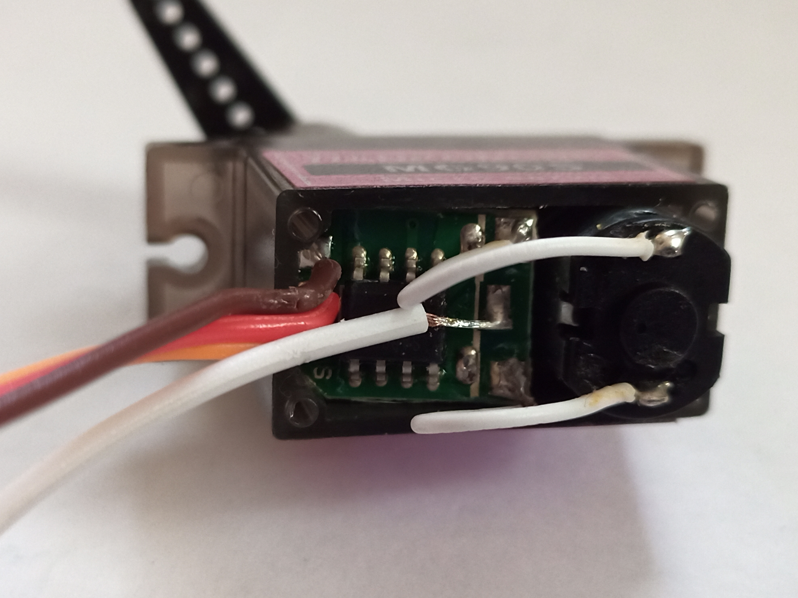

---
title: Servo Controller
layout: template
filename: servo
order: 1
show_tab: 1
--- 

# Servo Controller

## Demo Video
Here is a video demo of the project as it currently stands:
<iframe width="640" height="385" src="https://www.youtube.com/embed/mt5a9yana8U" title="YouTube video player" frameborder="0" allow="accelerometer; autoplay; clipboard-write; encrypted-media; gyroscope; picture-in-picture" allowfullscreen></iframe>

## Design
To begin, I needed to find a way to find out the position of a servo, so that I could use its position as an input to the system.

I did this by opening up the servo, and soldering a wire to the potentiometer inside the servo, giving me the ability to receive an analog signal from servo as an input to the circuit:

Servos take in a PWM signal, which modifies the pulse width of a square wave in order to represent different values. In order to generate such a signal, I first created a simple oscillator to generate a wave by repeatedly charging and discharging a capacitor.

To convert this triangle wave into a PWM signal, I compared the triangle wave to a constant voltage with another op amp. Varying the constant voltage would vary the duty cycle of the outputted square wave, which allows it to be used as a PWM input for the servo.

To determine exactly what the constant voltage should be, I used another op amp to compare the analog outputs from each servo, and put that through a low-pass filter, to prevent the signal from changing so rapidly, that the servo would not be able to keep up.

## Future Development

I plan on adding a more advanced control mechanism. Currently, it simply looks at which direction to move the motor in, and slows down its the signal with a low-pass filter to prevent an extreme overshoot. This results in oscillatory behaviour because it is similar to bang-bang tuning. I would like to implement PID tuning (or some subset of it, such as PI or PD). Although implementing an exact integral or derivative function would be near impossible to do with analog circuitry, it can be well approximated with a low-pass or high-pass filter.
